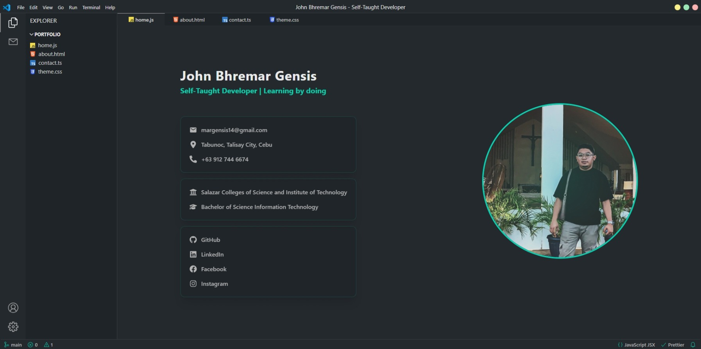

## Portfolio with the VS Code Theme

## Table of Contents

- [Overview](#overview)
  - [Screenshot](#screenshot)
  - [Links](#links)
- [My Process](#my-process)
  - [Built With](#built-with)
- [How to Use](#how-to-use)
- [Make It Your Own](#make-it-your-own)

---

## Overview

### Screenshot



### Links

- **Live Demo**: [https://jb-gensis.vercel.app/](https://jb-gensis.vercel.app/)

---

## My Process

### Built With

- [Vite](https://vitejs.dev/) – Frontend build tool
- [React](https://reactjs.org/) – JavaScript library for building UIs
- [TypeScript](https://www.typescriptlang.org/) – Typed JavaScript
- [Chakra UI](https://chakra-ui.com/) – Component library for styling
- [EmailJS](https://www.emailjs.com/) – For email sending functionality
- [Formik](https://formik.org/) – For form handling

---

## How to Use

1. **Fork** this repository to your GitHub account.
2. **Clone** the forked repository:
   ```bash
   git clone https://github.com/your-username/vs-code-themed-portfolio.git
   ```
3. Navigate to the project folder:
   ```bash
   cd vs-code-themed-portfolio
   ```
4. Install all dependencies:
   ```bash
   npm install
   ```
5. Start the development server:
   ```bash
   npm run dev
   ```
6. Open your browser and go to [http://localhost:5173](http://localhost:5173) to view your local version.

---

## Make It Your Own

This project was designed to be **developer-friendly and customizable**.

- Go to the `/public/data` folder.
- You'll find simple `.ts` files containing your:
  - Bio
  - Skills
  - Projects
  - Contact Info
- Modify those JavaScript objects with your own content.
- Restart the dev server to apply changes:
  ```bash
  npm run dev
  ```

No complicated setup or backend configuration required!


